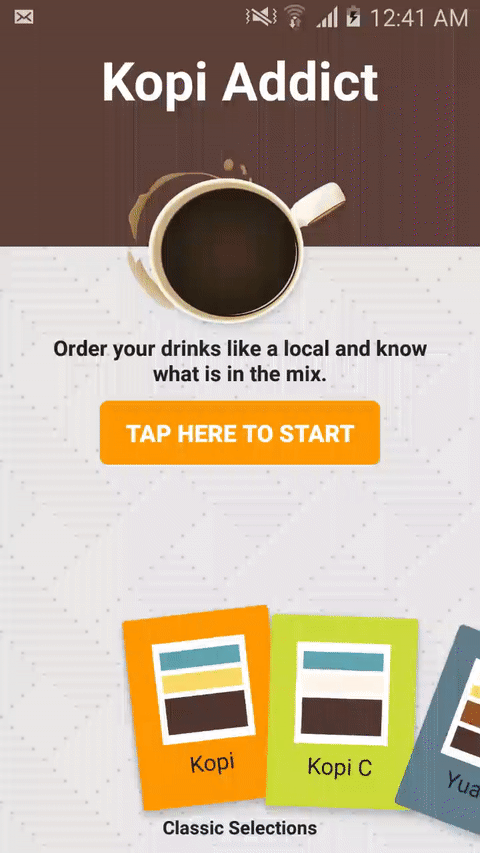

# KopiAddict
A fun experimental project that shows you how to order tea or coffee the local way in Singapore
* Starts off with few ready made popular drinks
* See the composition of the drink. i.e. 2 parts coffee + 1 part evaporated milk + part water
* Shows you how to order the drink in local tongue
* Allow you to create your own drink

# What is it made of?
* [Android Data Binding Library](https://developer.android.com/topic/libraries/data-binding/index.html) Binding of xml elements, auto-update on data change
* [Realm Database](https://realm.io) Fully open source client side database
* [MVVM Framework](https://en.wikipedia.org/wiki/Model–view–viewmodel) Works quite well with data binding library.
* [FanLayout Manager](https://github.com/Cleveroad/FanLayoutManager) A beautiful UI library that provides a horizontal list with fan-out blade style
* [RxJava](https://github.com/ReactiveX/RxJava) Reactive extensions for JVM - a library for composing asynchronous and event-based programs using observable sequences for the Java VM.
* [Parceler](https://github.com/johncarl81/parceler) Android Parcelable made easy
* [WaveView](https://github.com/gelitenight/WaveView) Great reference to generating water wave like animation on view
* [Subtle Patterns](http://subtlepatterns.com) Background pattern image
* [Material Palette](https://www.materialpalette.com) Color theme generator
* [NucleoApp](https://nucleoapp.com) Icons
* The usual material support library from Google

# Updates
## v1.0
First version with 3 main elements: dashboard, drinks maker and drinks details.

# Todo
* Polishing: Custom fonts, Update fanout list item, more animations, drink details layout
* Feature: allow user to remove drink from fanout
* Tweak: Improve startup time and performance, better way to pre-populate database
* Build and deploy to Google Playstore
* Add Crashlytics
* More testing on different screen sizes
* Write unit tests

# Screen Shots

